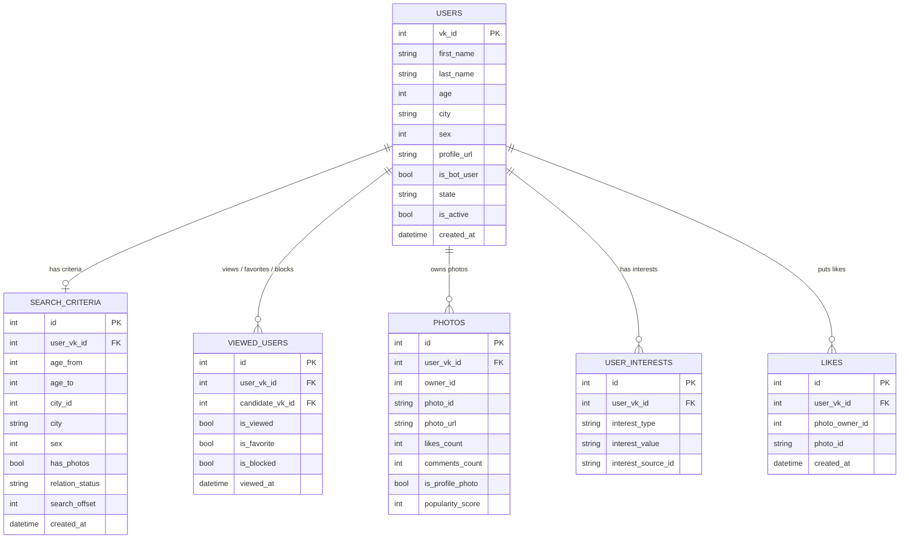

# Схема базы данных VKinder

Ниже текстовая ER-схема основных таблиц и связей проекта.

Кратко по логике:
- `users` хранит и пользователей бота, и найденных кандидатов (`is_bot_user` отличает тип записи).
- `search_criteria` содержит активные критерии поиска для пользователя бота.
- `viewed_users` объединяет просмотр, избранное и черный список.
- `photos` хранит отобранные фото кандидатов.
- `user_interests` хранит нормализованные интересы по типам (`groups`, `music`, `books`).
- `likes` фиксирует лайки пользователя по фотографиям кандидатов.
